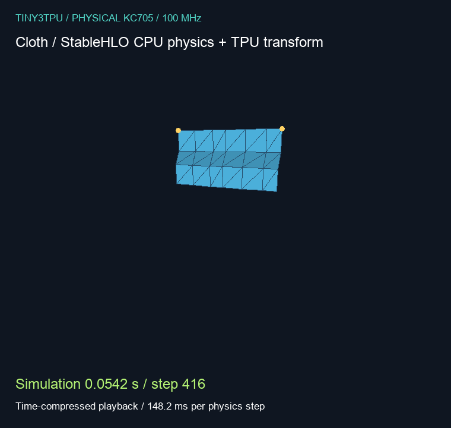

# tiny3tpu

`tiny3tpu` is me trying to make a stupidly small TPU-ish thing do real work on an FPGA and, against reason, it actually does.

It started with matrix multiplication and MNIST: take a digit, shove it through a tiny hardware stack I built, and get a prediction back. Then the obvious bad idea was to make it run other stuff too. So now there is a compiler, a rotating banana, an attention block, and cloth physics that very clearly lets you know when software floating point is having a bad day.

The point is still the same: make the hardware actually do the work, without pretending this is some giant polished accelerator project.

The two earlier writeups are:

- [Tiny TPU in a Week](https://5iri.me/blog/tiny-tpu-week)
- [Update: tiny tpu is now bigger!](https://5iri.me/blog/tiny-tpu-is-now-bigger)

## The current pile of parts

The current board setup is a KC705 with:

- a VexRiscv RV32IM CPU at **100 MHz**
- **two 4×4 int8 systolic cores**, with int32 accumulation
- **64 KiB of on-chip RAM**
- a multiplier-free hyperbolic **CORDIC for exponential**
- packed MMIO transport between the CPU and TPU
- UART at **921600 baud** to get commands in and results out

The current demo images have no DDR runtime. The board has DDR hardware; getting a working memory path into this system is a separate problem. Having chips on the PCB unfortunately does not make the software's memory budget bigger.

The CPU handles state, control flow and scalar operations. The TPU does the matrix products it supports. CORDIC handles exponential when the compiler selects that target. Sine, cosine, square root and division still run on the CPU, and this CPU has no hardware FPU.


[Editable Excalidraw source](media/showcase/system-config.excalidraw).

## The compiler bit

I do not want a separate handwritten math kernel for every demo. The idea is to give the compiler a tensor program and let the backend figure out what this pile of hardware can do with it.

The interface is **StableHLO**. JAX is one way to produce it:

```text
JAX function / another StableHLO producer
    |
    | export offline
    v
StableHLO
    |
    | verify operations, lower them, fuse eligible work,
    | plan buffers, choose CPU / TPU / CORDIC placement
    v
Generated RISC-V code + accelerator calls
    |
    v
KC705 executes the program and keeps its state
    |
    | UART results
    v
Host generates pixels
```

JAX runs on the host while exporting and checking a program. It does **not** run the model or physics step in these live board demos. The host sends commands, receives results, and does the projection, lighting and rasterization needed to put something on screen.

This is a generic compiler path, but it supports a **subset of StableHLO today**. It does not magically turn arbitrary float math into an int8 graph, and unsupported operations still need backend work. Approximate math and quantized transformations are explicit choices. The banana and cloth are examples, not special compiler passes.

The implementation is in [tools/program](tools/program), with the optional JAX exporter in [tools/jax_stablehlo.py](tools/jax_stablehlo.py).

## Things that actually ran on the board

### The banana

The CPU updates its angle. The TPU transforms the mesh into camera coordinates. The host turns those coordinates into pixels. About **29.6 ms of board compute per frame** for the reduced 204-vertex mesh.

This is adapted from the banana rendering example in [SRA-VJTI/jaxsim](https://github.com/SRA-VJTI/jaxsim/blob/c0a097bba1c6db10cac7b359fbac11cfedc48c6b/examples/softras_simple_render.py). 


### A trained digit classifier

A small **784 → 10** MNIST classifier, trained offline on 60,000 images and quantized to int8. The quantized model gets **92.78% accuracy on the separate 10,000-image test set**. The float32 version gets 92.85%.

The board does the matrix product, bias, logit scaling and prediction. About **104 ms per image**. The GIF uses the first 20 test images, without picking only the ones that look good. It gets 19 right; the 5 it calls a 6 stays in there because that is what the model actually did.

All ten returned logits matched the native generated-C reference for each of those 20 physical samples. The full test-set accuracy was measured offline; we did not run all 10,000 images through the board.


Training and export: [train_classifier.py](sidequests/showcase/train_classifier.py). Board firmware: [classifier_firmware.c](sidequests/showcase/classifier_firmware.c). The [live viewer](sidequests/showcase/classifier_live.py) checks returned results and draws them, with no host classifier execution.

### Attention, and why there is now a CORDIC

An 8-token, 8-feature causal attention block runs normalization, Q/K/V, masking, softmax, projection and a residual. Six int8 matrix products go through the TPU. This uses synthetic weights to check execution; it is not a pretrained language model.

Software exponential was expensive enough to be annoying, so we added a hardware CORDIC and taught the compiler to lower `stablehlo.exponential` to it.

| Same attention fixture | Physical board compute |
|---|---:|
| Software exponential | 52.57 ms |
| CORDIC exponential | 45.92 ms |

That is **14.5% less compute time**, with all 64 checked output words matching the native reference. It is a speedup for the complete attention fixture, not a claim that the whole system suddenly became fast at everything.

The hardware is in [hardware/math](hardware/math). The 40,014-vector RTL test observed at most two float32 ULPs of error and 187 cycles of latency. Approximate math, tested; not a proof of perfect rounding.

### Cloth, where the pain is visible

The compiler generates the physics program. VexRiscv runs the floating-point physics, and the TPU transforms the resulting geometry. In the final capture, physics takes around **150 ms per tiny integration step**. The timestep is **1/7680 of a second**.

So yes, it runs. No, display FPS does not mean the cloth is keeping up with real time. This GIF is deliberately **time-compressed**, with the actual simulation time and measured per-step cost printed on it.



The physical regression checked all 180 state words and 84 camera coordinate words against independently executed native generated C for the tested requests. That is a check of this implementation, not a promise of long-run equivalence to the original floating-point JAX trajectory.

The source is in [sidequests/cloth](sidequests/cloth).

### The language model that does not fit

We also checked pretrained TinyStories-1M. Its int8 token embeddings alone would need **3.07 MiB**, roughly **49× the entire RAM in this image**. Other weights, firmware, quantization metadata and working memory are extra.

This is a memory audit. There is no pretrained text generation running on this board. CORDIC does not help you store three megabytes in 64 KiB. A verified larger-memory runtime or weight-streaming path comes first.

The pinned model configuration and measured reports are in [media/showcase/evidence](media/showcase/evidence).

## Running the compiler and checks

Use Python 3.12 or newer for the pinned StableHLO/JAX dependencies:

```bash
python3 -m venv .venv
.venv/bin/pip install -r tools/requirements-stablehlo.txt

cmake -S . -B build -DCMAKE_C_STANDARD=11 -DCMAKE_C_EXTENSIONS=OFF \
  -DPython3_EXECUTABLE="$PWD/.venv/bin/python"
cmake --build build -j2
ctest --test-dir build --output-on-failure
```

There are native compiler/runtime checks and RTL checks. Verilator runs actual CPU/TPU transport and generated firmware; Icarus covers additional protocol checks, and Yosys covers structural synthesis. Which tests are available depends on the tools installed. The complete configured suite passed **36 checks** when the CORDIC work landed.

Compile an exported StableHLO program into a C header:

```bash
.venv/bin/python -m tools.program program.mlirbc \
  --target kc705-cordic \
  --math-mode freestanding --allow-approximation \
  -o program.h --report program-report.json
```

Use `kc705` for an image without the exponential peripheral. Selecting `kc705-cordic` does not conjure hardware into an older bitstream: that image must have been built with `--cordic`.

Board builds use [kc705_open_build.py](tools/kc705_open_build.py), Yosys and nextpnr. [kc705_export_bitstream.py](tools/kc705_export_bitstream.py) checks routed timing and bitstream frame roundtrip. A generated header or a passing host test is not the same thing as a programmed, verified board.

The showcase firmware, export scripts and physical checks live in [sidequests/showcase](sidequests/showcase). The trained weights and demo inputs are checked in under [evidence/classifier](media/showcase/evidence/classifier).

## The earlier MNIST stack is still here

The original cached-model path has model upload, draw-and-infer, blocked logical `16×16` GEMM, and UART/UDP request-response transport. Those larger matrix operations are tiled; they do not mean the current RTL has a physical 16×16 array.

[firmware.c](firmware.c) and [pyfiles](pyfiles) contain that path. It uses a different firmware/protocol from the current no-DDR StableHLO demos. Match the host tool to the image you programmed, or enjoy yelling binary packets into the void.

```bash
pip install -r requirements.txt

# Raw GEMM over UART or UDP, with the matching older firmware
python3 pyfiles/uart_matrix_host.py --port /dev/ttyUSB1
python3 pyfiles/uart_matrix_host.py --udp-host 192.168.1.77

# Cached-model samples and draw-and-infer
python3 pyfiles/mnist_infer_uart.py --udp-host 192.168.1.77 --count 20
python3 pyfiles/mnist_draw_uart.py --udp-host 192.168.1.77

# Train/export a model for that path
python3 pyfiles/train_mnist_hw.py --epochs 8 --export mnist_int8_4layer.json
```

## What is next

More generic backend math, less CPU overhead getting tiles into the TPU, and a verified memory path so larger models can stop failing the very first storage calculation.
