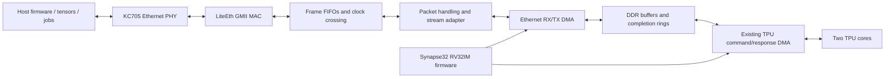

# Ethernet transport extension

Status: architecture notes for the user's Ethernet direction. Ethernet RTL,
firmware loading and network traffic are not present in the current tests or
timing netlists. The active implementation remains CPU + DDR + TPU DMA.

The installed KC705 platform exposes an eight-bit GMII Ethernet interface,
MDIO/MDC and PHY reset. LiteX's KC705 target already connects those pads to
LiteEth. An open implementation can reuse the BSD-2-Clause
[LiteEth MAC/PHY and UDP streaming support](https://github.com/enjoy-digital/liteeth)
and the existing MIT verilog-axi DMA engine. LiteEth's native streaming interface
still needs an adapter to this design's AXI Stream width, byte enables and packet
metadata; an AXI DMA connection is not already implemented by this project.

## Hardware boundaries

- Use a separate Ethernet RX/TX DMA instance and DDR master port. The current
  DMA's two directions belong to TPU commands and their responses. Reusing that
  instance concurrently would require ownership arbitration and block useful
  overlap. The same open engine source can serve both instances.
- Keep Ethernet frames and two-word TPU packets as separate protocols. The
  existing TPU framer cannot delimit raw Ethernet frames. Convert native MAC
  stream width, final-byte enables, frame boundaries and error metadata explicitly.
- Cross GMII RX/TX clock domains through frame FIFOs into the 100 MHz system
  domain. Gigabit GMII uses a 125 MHz byte clock; it does not require changing the
  CPU/system target to 125 MHz. PHY clock/reset and MDIO bring-up require their
  own constraints and tests.
- Publish an RX completion only after the complete frame is accepted and its
  status is known. A CRC error, overflow, link loss or reset must leave a slot
  unpublished or marked failed; partial packets must not become runnable jobs.
- Arbitrate DDR access between CPU, TPU DMA and Ethernet DMA. Measure both
  sustained payload rate and worst-case CPU service latency under simultaneous
  RX, TX and TPU work. The current independent behavioral DMA delay model does
  not establish physical bandwidth or contention behavior.

## Firmware boundaries

RV32IM firmware manages bounded buffer rings, batches completions, builds TPU
command batches and returns results. Ordinary loads/stores, MMIO and fences
are sufficient; no Ethernet-specific or TPU-specific CPU instruction is needed.
Batching completion work avoids an interrupt and a CPU copy for every word.

For a first host protocol, bounded UDP messages can carry a version, job ID,
message type, total size, chunk offset and payload length. Firmware tracks chunk
completion and duplicate submissions before releasing a complete job to the TPU.
The host can retry missing chunks. The exact wire ABI should be frozen with the
host test tool, then used by RTL and firmware tests.

Network firmware loading also needs a resident boot program: initialize DDR and
Ethernet, receive an image into a reserved region, check its completeness and
integrity, then use the existing instruction synchronization sequence before
jumping to its entry point. Reserve image, DMA and selftest regions together in
the linker/memory map; the current DDR selftest must not overwrite a downloaded
program. The presently generated boot ROM remains required until that loader
exists.

## Acceptance

Add loopback and host-to-TPU tests covering packet truncation, byte tails, CRC
errors, reordering/duplicates, FIFO overflow, link reset and concurrent DDR
traffic. Re-run the identical CPU instruction benchmark and report enabled-edge
IPC separately from system cycles and network payload throughput. Then route
the complete Ethernet + CPU + DDR + TPU design with all clock domains constrained.
The current timing results must not be presented as Ethernet timing results.

Board integration reference:
[LiteX KC705 target](https://github.com/litex-hub/litex-boards/blob/master/litex_boards/targets/xilinx_kc705.py).
